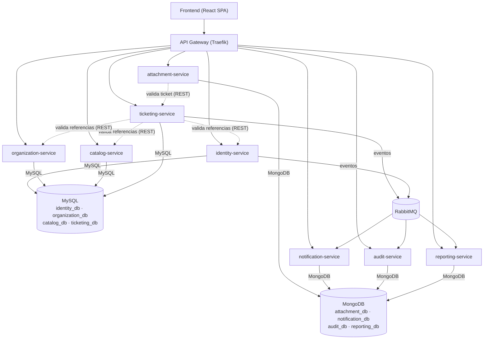

# Plan de Migración a Microservicios — Sistema de Gestión de Tickets (HelpDesk)

> **Tipo de documento:** Análisis arquitectónico + plan de migración + bitácora de implementación (documento vivo).
> **Estado (2026-10-01): migración completa y monolito dado de baja.** Las secciones 1-11 son el análisis y plan originales (previos a tocar código). La sección 12 documenta la implementación real, fase por fase — **los 9 microservicios de dominio tienen lógica de negocio real**, corriendo en Docker, validada de punta a punta (ver 12.9, cierre real tras retomar la Fase 7 de adjuntos) y con la colección de contrato en verde contra el gateway (ver `tests/contract/README.md`). El monolito original (`backend/`) nunca se modificó mientras existió, y se eliminó del repositorio una vez confirmado que los microservicios lo cubrían por completo — todas las referencias a `backend/` en el resto de este documento (secciones 1-11 y 12) son históricas, describen el estado del repo *durante* la migración, no el actual.

---

## 1. Resumen ejecutivo

El backend actual es un **monolito modular** (Node.js + Express + TypeScript + Prisma) razonablemente bien organizado por dominio (`src/modules/*`), lo cual es una buena noticia: **los límites de los futuros microservicios ya están casi dibujados por la propia estructura de carpetas**. Esto reduce el riesgo de la migración porque no hay que "adivinar" el dominio, sino extraer módulos que ya están relativamente aislados.

Puntos clave del análisis:

- **13 módulos de dominio** actuales, con tamaños muy dispares: desde `statuses` (72 líneas) hasta `tickets` (981 líneas, el núcleo del sistema).
- **Una sola base de datos relacional** (Prisma, `provider = postgresql`) con integridad referencial fuerte (FKs) entre prácticamente todas las entidades. Este es el principal reto de la migración: hay que romper esas relaciones sin perder consistencia.
- **Acoplamiento por librerías compartidas**, no por HTTP: `lib/notifications.ts`, `lib/audit.ts`, `lib/sla.ts`, `lib/ticket-number.ts` y `middleware/*` se importan directamente desde varios módulos. Al separar en servicios, esto se convierte en la pregunta central: ¿llamadas síncronas (REST), eventos (mensajería), o librería compartida versionada?
- El sistema **no usa MongoDB actualmente**; se propone introducirlo para los dominios de datos no relacionales / append-only (auditoría, notificaciones, adjuntos, configuración), y mantener **MySQL** para los dominios transaccionales/relacionales (identidad, organización, catálogos, ticketing).
- Se propone una migración **estilo Strangler Fig**: introducir un API Gateway delante del monolito sin cambios visibles, y extraer servicios uno a uno, del menos acoplado al más acoplado, terminando por el núcleo de tickets.
- El resultado final vive **100% en Docker** en ambiente local mediante `docker-compose`, con un contenedor por servicio, un contenedor MySQL, un contenedor MongoDB, un broker de eventos y un gateway/reverse proxy.

---

## 2. Estado actual del sistema (línea base)

### 2.1 Stack tecnológico

| Capa | Tecnología |
|---|---|
| Frontend | React + Vite + TypeScript, TanStack Query, Tailwind, Recharts |
| Backend | Node.js + Express + TypeScript (ESM), Zod, JWT (`jsonwebtoken`), `bcryptjs`, `multer`, `helmet`, `express-rate-limit` |
| ORM / datos | Prisma ORM, `provider = postgresql` (el comentario del schema y el `.env.example` mencionan SQLite como atajo de desarrollo — hay una inconsistencia menor entre comentario y `provider` real, sin impacto funcional) |
| Autenticación | JWT de acceso + refresh token rotativo con hash en BD (`RefreshToken`), recuperación de contraseña (`PasswordReset`) |
| Archivos | `multer` con `diskStorage` local (`backend/uploads/`), sin object storage |
| Despliegue actual | Proceso único Node sirviendo API (`/api/*`) **y** el build estático del frontend (`app.ts` sirve `frontend/dist`) — no hay contenedores ni separación de despliegue hoy |

### 2.2 Inventario de módulos actuales

| Módulo (`src/modules/...`) | Líneas | Responsabilidad | Entidades Prisma principales |
|---|---:|---|---|
| `auth` | 321 | Login, logout, refresh, olvido/reset de contraseña, perfil propio | `User`, `RefreshToken`, `PasswordReset`, `Role` |
| `users` | 245 | CRUD de usuarios, alta de técnicos, reseteo de password por admin | `User`, `Role`, `Company`, `Department` |
| `companies` | 117 | CRUD de empresas cliente | `Company` |
| `departments` | 110 | CRUD de departamentos (dependen de empresa) | `Department` |
| `categories` | 165 | Categorías y subcategorías de tickets | `TicketCategory`, `TicketSubcategory` |
| `priorities` | 134 | Prioridades y su configuración de SLA | `TicketPriority`, `SlaConfiguration` |
| `statuses` | 72 | Catálogo de estados de ticket | `TicketStatus` |
| `tickets` | 981 | **Núcleo del sistema**: CRUD, comentarios, adjuntos, historial, asignación/reasignación, cambio de estado, solución, confirmación, reapertura, cancelación, export | `Ticket`, `TicketComment`, `TicketAttachment`, `TicketHistory`, `TicketAssignment`, `TicketSolution` |
| `notifications` | 80 | Notificaciones internas del usuario autenticado | `Notification` |
| `dashboard` | 251 | KPIs y series para gráficas por rol | Lecturas agregadas de `Ticket` |
| `reports` | 253 | Reportes de productividad, SLA, por empresa, export | Lecturas agregadas de `Ticket`, `User`, `Company` |
| `audit` | 72 | Consulta del log de auditoría (solo MASTER) | `AuditLog` |
| `settings` | 70 | Configuración clave-valor del sistema | `Setting` |

Código transversal relevante (no es un módulo, pero define acoplamientos):

| Archivo | Uso |
|---|---|
| `middleware/auth.ts` | Verifica JWT y **carga el usuario completo desde BD en cada request** (incluye `role`, `company`, `department`) |
| `middleware/rbac.ts` | `requireRole(...)`, usado por 8 de los 13 módulos |
| `middleware/upload.ts` | `multer` + validación de extensión/MIME, usado solo por `tickets` (adjuntos) |
| `lib/notifications.ts` | `createNotification`, `notifyRole` — invocado en caliente (síncrono, in-process) desde `tickets` y `auth` |
| `lib/audit.ts` | Registro de auditoría — invocado desde `tickets`, `users`, `companies`, `departments`, `priorities`, `statuses`, `categories`, `settings` |
| `lib/sla.ts` | Cálculo de vencimiento de SLA — usado por `tickets` y `reports` |
| `lib/ticket-number.ts` | Generación de `TKT-AAAA-NNNNNN` — usado por `tickets` |

### 2.3 Inventario de endpoints actuales (mapa base para el gateway)

<details>
<summary>Ver los ~65 endpoints agrupados por módulo (clic para expandir)</summary>

| Módulo | Endpoints |
|---|---|
| `auth` | `POST /login`, `POST /logout`, `POST /refresh`, `POST /forgot-password`, `POST /reset-password`, `GET /me`, `PUT /profile`, `PUT /password` |
| `users` | `GET /`, `GET /technicians`, `GET /:id`, `POST /`, `PUT /:id`, `PATCH /:id/status`, `POST /:id/reset-password` |
| `companies` | `GET /`, `GET /:id/departments`, `POST /`, `PUT /:id`, `DELETE /:id` |
| `departments` | `GET /`, `POST /`, `PUT /:id`, `DELETE /:id` |
| `categories` | `GET /`, `POST /`, `PUT /:id`, `DELETE /:id`, `GET /:id/subcategories`, `POST /subcategories`, `PUT /subcategories/:id`, `DELETE /subcategories/:id` |
| `priorities` | `GET /`, `POST /`, `PUT /:id`, `DELETE /:id`, `GET /:id/sla`, `PUT /:id/sla` |
| `statuses` | `GET /`, `POST /`, `PUT /:id` |
| `tickets` | `GET /`, `GET /export`, `POST /`, `GET /:id`, `PATCH /:id`, `GET /:id/history`, `POST /:id/comments`, `POST /:id/attachments`, `GET /:id/attachments/:fileId`, `POST /:id/assign`, `POST /:id/reassign`, `POST /:id/status`, `POST /:id/resolve`, `POST /:id/confirm`, `POST /:id/reopen`, `POST /:id/cancel` |
| `notifications` | `GET /`, `GET /unread-count`, `POST /:id/read`, `POST /read-all` |
| `dashboard` | `GET /summary`, `GET /by-status`, `GET /by-priority`, `GET /by-category`, `GET /by-technician`, `GET /per-day`, `GET /avg-resolution` |
| `reports` | `GET /tickets`, `GET /productivity`, `GET /sla`, `GET /companies`, `GET /export` |
| `audit` | `GET /`, `GET /actions` |
| `settings` | `GET /`, `PUT /` |

</details>

### 2.4 Riesgos de acoplamiento identificados (antes de decidir los cortes)

1. **`User` es una entidad transversal.** Casi todas las tablas tienen FK a `User` (tickets, comentarios, adjuntos, historial, asignaciones, soluciones, notificaciones, auditoría, refresh tokens). Es el reto #1 de cualquier descomposición: hay que decidir si otros servicios guardan solo el `userId` (referencia débil) y resuelven el nombre/rol vía API o vía copia local sincronizada por eventos.
2. **`Company` / `Department` se usan tanto en `User` como en `Ticket`** (el ticket guarda una copia "snapshot" de nombre/email del solicitante, pero sí referencia `companyId`/`departmentId` en vivo). Son catálogos relativamente estables — buen candidato a desacoplar temprano.
3. **`Ticket` referencia 6 entidades por FK** (`user`, `category`, `subcategory`, `priority`, `status`, `company`, `department`, `assignedTechnician`) más las relaciones hijas (comentarios, adjuntos, historial, asignaciones, soluciones, notificaciones). Es, por diseño, el módulo con más aristas de dependencia — confirma que debe extraerse **al final**, cuando todos sus proveedores de datos ya existan como servicios independientes.
4. **Auditoría y notificaciones se invocan hoy in-process** (llamada de función, no HTTP) desde dentro de las transacciones de `tickets`. Al separarlas, si se mantiene la llamada síncrona por HTTP, el request de creación de ticket se vuelve más lento y frágil (depende de la disponibilidad de 2 servicios más). Es el caso de uso de libro de texto para introducir **eventos asíncronos**.
5. **Los adjuntos se sirven desde disco local** (`backend/uploads/`) con autorización por token en el mismo proceso que valida el ticket. Al separar en un servicio de archivos, hay que decidir cómo se preserva la autorización (¿el servicio de adjuntos valida el JWT él mismo, o confía en un header inyectado por el gateway?).
6. **Reportes y dashboard no tienen entidad propia**: son consultas agregadas en caliente sobre `Ticket`/`User`/`Company`. Al separar el ticketing en su propia base de datos, estas consultas dejan de poder hacer `JOIN` directo — se convierten en **agregaciones vía API o en un modelo de lectura materializado**.

---

## 3. Inventario de futuros microservicios

Se identifican **9 microservicios de dominio + 1 componente de infraestructura (API Gateway)**. Los tamaños se mantienen deliberadamente moderados (ni "nano-servicios" por cada catálogo, ni un monolito con otro nombre): se agrupan catálogos afines (categorías + prioridades + estados) en un solo servicio de catálogo, y se separa lo que tiene un perfil de carga, dueño de datos o ciclo de vida claramente distinto (auditoría, notificaciones, adjuntos).

### 3.1 Vista general

| # | Microservicio | Módulos de origen | Motor de BD propuesto | Patrón de datos |
|---|---|---|---|---|
| 1 | **identity-service** | `auth`, `users` (+ `Role`) | MySQL | Transaccional relacional |
| 2 | **organization-service** | `companies`, `departments` | MySQL | Transaccional relacional |
| 3 | **catalog-service** | `categories`, `priorities`, `statuses` (+ `SlaConfiguration`) | MySQL | Referencia / bajo volumen de escritura |
| 4 | **ticketing-service** | `tickets` (CRUD, comentarios, historial, asignaciones, soluciones) | MySQL | Transaccional relacional, núcleo del dominio |
| 5 | **attachment-service** | Adjuntos de `tickets` + `middleware/upload.ts` | MongoDB (metadatos) + volumen de archivos | Documental + blobs |
| 6 | **notification-service** | `notifications`, `lib/notifications.ts` | MongoDB | Documental, alto volumen de escritura |
| 7 | **audit-service** | `audit`, `lib/audit.ts` | MongoDB | Append-only / log |
| 8 | **reporting-service** | `dashboard`, `reports` | MongoDB (vistas materializadas) | CQRS / lectura agregada |
| 9 | **settings-service** *(opcional, fusionable)* | `settings` | MongoDB | Configuración clave-valor |
| — | **api-gateway** | `app.ts` (enrutamiento, CORS, rate-limit) | — | Infraestructura, sin datos propios |

### 3.2 Detalle por servicio

#### 1. `identity-service` — Identidad y acceso
- **Responsabilidad:** autenticación, emisión/rotación de tokens, gestión de usuarios, roles.
- **Entidades que pasa a poseer:** `User`, `Role`, `RefreshToken`, `PasswordReset`.
- **Por qué MySQL:** credenciales y tokens exigen integridad transaccional fuerte, unicidad estricta (`email`, `tokenHash`) e índices — encaja de forma natural en un motor relacional. No hay ninguna ventaja del modelo documental aquí.
- **Por qué se prioriza temprano:** es el único servicio del que **dependen todos los demás** (todo request pasa por `authenticate`). Conviene independizarlo pronto para que el resto de servicios validen tokens contra un endpoint propio (o JWKS) en vez de seguir dependiendo del monolito.
- **Endpoints:** los actuales de `auth` + `users` sin cambios de contrato.
- **Consumidores:** API Gateway (validación de token en cada request), todos los demás servicios (para resolver `userId` → nombre/rol cuando haga falta, vía API o cache local).

#### 2. `organization-service` — Estructura organizacional
- **Responsabilidad:** empresas cliente y departamentos.
- **Entidades:** `Company`, `Department`.
- **Por qué MySQL:** relación jerárquica simple (empresa → departamentos) con restricciones de unicidad (`@@unique([companyId, name])`) — caso de libro para relacional.
- **Consumidores:** `identity-service` (un usuario pertenece a una empresa/depto), `ticketing-service` (el ticket referencia empresa/depto en vivo).
- **Nota de diseño:** es un candidato a fusionarse con `identity-service` si el equipo prefiere menos servicios; se separa aquí porque el ciclo de cambio es distinto (la organización la administra el cliente MASTER, casi no cambia; los usuarios cambian con más frecuencia).

#### 3. `catalog-service` — Catálogos del dominio de tickets
- **Responsabilidad:** categorías, subcategorías, prioridades, estados, y la configuración de SLA por prioridad.
- **Entidades:** `TicketCategory`, `TicketSubcategory`, `TicketPriority`, `TicketStatus`, `SlaConfiguration`.
- **Por qué MySQL:** relaciones simples pero reales (categoría → subcategoría, prioridad → SLA) y necesidad de unicidad/orden (`sortOrder`, `@@unique`).
- **Perfil de carga:** lectura muy alta, escritura muy baja (solo el MASTER administra catálogos) → buen candidato a **cache** (Redis o in-memory con invalidación por evento) en los servicios que lo consumen, en vez de llamarlo en cada request.
- **Consumidores:** `ticketing-service` (valida categoría/prioridad/estado al crear o actualizar un ticket), `reporting-service`.

#### 4. `ticketing-service` — Núcleo del negocio
- **Responsabilidad:** todo el ciclo de vida del ticket: creación, comentarios, historial, asignación/reasignación, cambio de estado, solución, confirmación, reapertura, cancelación, export.
- **Entidades:** `Ticket`, `TicketComment`, `TicketHistory`, `TicketAssignment`, `TicketSolution` (los metadatos de adjunto se mueven a `attachment-service`, ver más abajo).
- **Por qué MySQL:** es el dominio con más restricciones de integridad e índices compuestos del sistema (`@@index([statusId, createdAt])`, etc.); necesita transacciones ACID reales al registrar en una sola operación lógica el cambio de estado + el historial + la notificación disparada.
- **Por qué se extrae al final:** depende, para poder validar sus escrituras, de `identity-service` (usuario/técnico), `organization-service` (empresa/depto) y `catalog-service` (categoría/prioridad/estado) — los tres deben existir de forma estable antes de cortar este servicio, o la validación de referencias se vuelve imposible de resolver de forma limpia.
- **Comunicación saliente:** publica eventos de dominio (`TicketCreated`, `TicketAssigned`, `TicketStatusChanged`, `TicketCommentAdded`, `TicketResolved`, `TicketClosed`, `TicketReopened`, `TicketCanceled`) para que `notification-service`, `audit-service` y `reporting-service` reaccionen sin acoplarse por llamada síncrona.

#### 5. `attachment-service` — Archivos adjuntos
- **Responsabilidad:** subida, validación (tipo/tamaño) y descarga autorizada de archivos adjuntos a tickets y comentarios.
- **Por qué se separa de `ticketing-service`:** el manejo de binarios tiene un perfil de infraestructura distinto (almacenamiento, límites de tamaño, posible migración futura a S3/MinIO, según ya contempla `docs/propuesta-tecnica.md`) — mezclarlo con la lógica transaccional de negocio del ticket sería forzar dos preocupaciones muy distintas en el mismo servicio.
- **Por qué MongoDB para los metadatos:** el documento de metadatos (`nombre original`, `nombre almacenado`, `mime`, `tamaño`, `ticketId`, `commentId`, `userId`) no tiene relaciones internas complejas ni necesita JOINs — es un caso natural de documento. El **binario en sí** no va en ninguna base de datos: vive en un volumen Docker montado (y en el futuro, en un bucket S3/MinIO).
- **Consumidores:** `ticketing-service` (referencia `attachmentId` en el detalle del ticket), frontend (descarga directa autorizada).

#### 6. `notification-service` — Notificaciones internas
- **Responsabilidad:** creación y consulta de notificaciones del usuario autenticado (hoy) y, en una fase futura ya contemplada en el código (`SMTP_*` en `.env.example`), envío de correo.
- **Por qué MongoDB:** el esquema de una notificación varía según su `type` (10 tipos hoy, ver `NOTIFICATION_TYPES`), el volumen de escritura es alto (una notificación por evento de negocio, a veces multiplicada por todos los usuarios de un rol vía `notifyRole`), no requiere JOINs, y se beneficia de índices TTL para expirar/archivar notificaciones leídas antiguas — todo esto encaja mejor en un modelo documental que en tablas rígidas.
- **Comunicación entrante:** **consumidor de eventos** (no debe ser llamado de forma síncrona desde `ticketing-service`, tal como ocurre hoy en el código; ese es justo el acoplamiento que se debe romper).

#### 7. `audit-service` — Auditoría
- **Responsabilidad:** registro inmutable de acciones sensibles del sistema (quién hizo qué, cuándo, desde qué IP).
- **Por qué MongoDB:** es, por definición, un log **append-only** de alto volumen con forma variable según `entityType`/`action` — el caso de uso de referencia para una base documental orientada a escritura. Además, aislar la auditoría en su propia base evita que un pico de escritura de logs compita por recursos con las transacciones de negocio (algo que sí puede pasar hoy, al compartir la misma base Postgres).
- **Comunicación entrante:** consumidor de eventos de todos los demás servicios (`ticketing-service`, `identity-service`, `catalog-service`, etc.), igual que hoy consume llamadas de `lib/audit.ts` desde 8 módulos distintos.

#### 8. `reporting-service` — Dashboard y reportes
- **Responsabilidad:** KPIs, series para gráficas, reportes de productividad/SLA/por empresa, exportación.
- **Por qué no tiene "entidades propias" hoy:** porque todo se calcula en caliente con `groupBy`/`aggregate` de Prisma sobre `Ticket`. Al partir `ticketing-service` en su propia base, esas consultas cruzadas dejan de ser posibles con un simple `JOIN`.
- **Estrategia recomendada:** **CQRS ligero** — este servicio mantiene su propio almacén de lectura (MongoDB, óptimo para documentos agregados/denormalizados tipo "resumen por técnico" o "tickets por estado y día") que se alimenta de los eventos de dominio publicados por `ticketing-service` (y, si aplica, `identity-service`/`organization-service`). Se evita así pegarle con 10 requests síncronos a otros servicios cada vez que alguien abre el dashboard.
- **Es el último en construirse** porque necesita que `ticketing-service` ya exista y publique eventos de forma estable.

#### 9. `settings-service` (opcional / fusionable)
- **Responsabilidad:** configuración global clave-valor (`Setting`).
- **Por qué es candidato a no ser un servicio independiente:** son 70 líneas y una sola tabla clave-valor; el costo operativo de un contenedor, un pipeline de CI/CD y un espacio de nombres de red propio no se justifica todavía. Se documenta como candidato válido (encajaría en MongoDB por su naturaleza de documento simple) pero **se recomienda fusionarlo dentro de `identity-service` o `organization-service`** hasta que exista una razón de negocio concreta para separarlo (por ejemplo, si `Setting` crece para incluir configuración por empresa/tenant).

### 3.3 `api-gateway` — Puerta de entrada (no es un microservicio de dominio)

- **Responsabilidad:** único punto de entrada para el frontend; enruta cada `/api/<recurso>` al servicio correspondiente; centraliza CORS, rate-limiting (hoy en `app.ts` para `/api/auth/login` y `/api/auth/forgot-password`) y, opcionalmente, la validación de firma del JWT antes de reenviar el request.
- **Por qué es imprescindible para no tocar el frontend:** el frontend (`frontend/src/api/client.ts`) hoy le habla a un solo origen. Con el gateway, **ese contrato no cambia** durante toda la migración — el frontend nunca se entera de que detrás hay 1 monolito o 9 servicios.
- **Candidatos tecnológicos para Docker local:** Traefik (descubrimiento automático por labels de Docker, ideal para `docker-compose` local) o Nginx (más simple, configuración estática). Se recomienda **Traefik** para el ambiente local por la facilidad de añadir/quitar servicios sin tocar configuración a mano.

---

## 4. Estrategia de bases de datos

### 4.1 Regla de decisión aplicada

| Se usa **MySQL** cuando... | Se usa **MongoDB** cuando... |
|---|---|
| Hay relaciones fuertes entre entidades (FKs reales) | Los datos son documentos autocontenidos, sin necesidad de JOIN |
| Se necesitan restricciones de unicidad/transacciones ACID multi-tabla | El volumen de escritura es alto y el esquema varía por tipo de registro |
| El dominio es transaccional (crear/actualizar con reglas de negocio estrictas) | El dato es esencialmente un log append-only o una notificación de "disparar y olvidar" |
| Ejemplos: identidad, organización, catálogos, ticketing | Ejemplos: auditoría, notificaciones, metadatos de adjuntos, vistas de reporte, configuración |

### 4.2 Un motor de BD por servicio, no una BD compartida

**Regla de oro de microservicios que se debe respetar desde el día uno:** cada servicio es dueño exclusivo de su base de datos; ningún otro servicio la consulta directamente. En ambiente local esto no significa necesariamente "un contenedor de MySQL por servicio" (sería pesado para una laptop): se recomienda:

- **Un contenedor MySQL** compartido a nivel de infraestructura, pero con **una base de datos lógica separada por servicio** (`identity_db`, `organization_db`, `catalog_db`, `ticketing_db`), cada una con su propio usuario/credenciales — así se preserva el aislamiento lógico sin pagar el costo de 4 contenedores MySQL en local.
- **Un contenedor MongoDB** compartido, con una base de datos lógica por servicio (`audit_db`, `notification_db`, `attachment_db`, `reporting_db`).
- En un ambiente productivo posterior (fuera del alcance de este entregable), esto puede evolucionar a instancias físicamente separadas si el volumen lo justifica.

### 4.3 El problema de la integridad referencial perdida

Hoy, Prisma + Postgres garantiza gratis que no se puede crear un ticket con un `categoryId` inexistente (FK). Al separar `catalog-service` de `ticketing-service`, esa garantía desaparece del motor de base de datos y pasa a ser **responsabilidad explícita de la aplicación**. Se documentan 3 estrategias, de más simple/segura a más escalable:

1. **Validación síncrona en el momento de escritura** *(recomendada para el arranque de la migración)*: `ticketing-service` llama por REST a `catalog-service`/`organization-service`/`identity-service` para confirmar que las referencias existen antes de escribir. Simple de razonar, pero añade latencia y una dependencia dura en tiempo de escritura.
2. **Copia local de solo lectura sincronizada por eventos** *(recomendada a mediano plazo)*: `ticketing-service` mantiene una tabla local minimalista (`id`, `nombre`, `activo`) de categorías/prioridades/estados/empresas, actualizada por eventos (`CategoryCreated`, `CompanyUpdated`, etc.). Reduce el acoplamiento en tiempo de request a costa de consistencia eventual.
3. **Reconciliación periódica**: job que audita referencias huérfanas y alerta — como red de seguridad adicional, no como mecanismo principal.

Se recomienda **empezar con la opción 1** durante la migración (prioriza corrección y simplicidad) y migrar a la opción 2 una vez el sistema esté completo y se observen problemas reales de latencia o disponibilidad — evitar optimizar prematuramente.

### 4.4 Mensajería para eventos de dominio

Para desacoplar `ticketing-service` de `notification-service`, `audit-service` y `reporting-service` (hoy acoplados por llamada de función in-process), se introduce un **broker de mensajería** en el `docker-compose` local. Recomendación: **RabbitMQ** (imagen oficial ligera, UI de administración incluida, buen soporte en Node.js) para el catálogo de eventos ya identificable en el código actual:

```
TicketCreated, TicketAssigned, TicketReassigned, TicketStatusChanged,
TicketCommentAdded, TicketResolved, TicketClosed, TicketReopened,
TicketCanceled, TicketOverdue, UserPasswordReset
```

Estos eventos son, en esencia, los mismos valores que hoy ya existen como strings en `NOTIFICATION_TYPES` y en el campo `action` de `TicketHistory` — la migración a eventos no inventa un dominio nuevo, **formaliza uno que ya existe** en el código.

---

## 5. Arquitectura objetivo



**Reglas de comunicación:**
- **Síncrono (REST/JSON)** solo para lo que necesita respuesta inmediata dentro del mismo request del usuario: Gateway → servicio, validación de referencias al escribir.
- **Asíncrono (eventos vía RabbitMQ)** para todo lo que hoy es "disparar y olvidar": auditoría, notificaciones, actualización del modelo de lectura de reportes.
- El **frontend nunca cambia su forma de consumir la API** — sigue hablando con un único origen (el gateway), igual que hoy habla con el monolito.

---

## 6. Estrategia de migración (Strangler Fig)

Principio general: **el monolito nunca se reescribe de una vez**; se le va "estrangulando" servicio por servicio. En cada fase, el gateway decide qué porcentaje/qué rutas de tráfico van al monolito y cuáles al nuevo servicio, y el código de negocio migrado se **traslada casi literal** (handlers, validaciones Zod, reglas de negocio) adaptando solo la capa de acceso a datos (nuevo `schema.prisma` apuntando a MySQL/Mongo) y las llamadas que antes eran imports directos y ahora son HTTP/eventos.

### Orden de extracción y justificación

| Fase | Qué se hace | Por qué en este orden |
|---|---|---|
| **0. Preparación** | Dockerizar el monolito **tal cual está** (sin tocar lógica): `Dockerfile` de `backend/` y `frontend/`, `docker-compose.yml` con su base de datos actual. Congelar el contrato de API (tests de regresión sobre los ~65 endpoints listados en §2.3). | No se puede migrar con seguridad lo que no se puede verificar primero. Este paso no cambia nada funcional, solo saca el sistema de "corre en mi máquina" a "corre en un contenedor reproducible". |
| **1. API Gateway** | Introducir Traefik/Nginx delante del monolito. 100% del tráfico sigue yendo al monolito; el gateway es transparente. | Crea la costura (seam) por la que, fase a fase, se irá desviando tráfico a los nuevos servicios — sin que el frontend note el cambio nunca. |
| **2. `identity-service`** | Extraer `auth` + `users` a su propio servicio con MySQL propio. | Es la dependencia transversal de **todo** el sistema; conviene resolverla pronto para que los siguientes servicios validen tokens contra un endpoint propio en vez de seguir atados al monolito. Se mitiga el riesgo manteniendo el monolito como *fallback* durante la transición (feature flag en el gateway). |
| **3. `audit-service`** | Extraer `audit` + `lib/audit.ts`, cambiar el registro de auditoría de llamada síncrona a evento consumido vía RabbitMQ. | Bajo riesgo: es un log de solo escritura desde la perspectiva de los demás módulos, sin lógica de negocio compleja ni respuesta que nadie espera de forma síncrona. Sirve además como piloto para validar el patrón de eventos antes de aplicarlo a algo más crítico. |
| **4. `notification-service`** | Extraer `notifications` + `lib/notifications.ts`, mismo patrón de eventos. | Mismo perfil de riesgo bajo que auditoría; consolida el patrón "publicar evento → consumidor independiente" antes de tocar el núcleo. |
| **5. `catalog-service`** | Extraer `categories`, `priorities`, `statuses` + `SlaConfiguration` a MySQL propio. | Datos de referencia, cambian poco, y aún no están en la ruta crítica de escritura de tickets (todavía el monolito posee `tickets`). Buen ensayo de "extraer un dominio relacional real" antes de tocar el núcleo. |
| **6. `organization-service`** | Extraer `companies`, `departments` a MySQL propio. | Mismo perfil que catálogo: referencia, bajo volumen de cambio, consumido pero no poseído por tickets. |
| **7. `attachment-service`** | Extraer el manejo de adjuntos (hoy dentro de `tickets`) a su propio servicio con MongoDB + volumen de archivos. | Aísla una preocupación de infraestructura (binarios) que no debería vivir en el mismo servicio que las reglas de negocio del ticket, antes de que ese servicio se vuelva más complejo de tocar. |
| **8. `ticketing-service`** | Extraer el núcleo (`tickets`: CRUD, comentarios, historial, asignaciones, soluciones) a MySQL propio; queda como último cambio grande sobre el monolito. | Es el módulo más grande (981 líneas) y con más dependencias salientes (usuario, categoría, prioridad, estado, empresa, departamento). Solo tiene sentido cortarlo cuando **todos** sus proveedores de datos (fases 2, 5, 6) ya son servicios independientes y estables — de lo contrario, tendría que seguir hablando con el monolito para validar referencias, duplicando trabajo. |
| **9. `reporting-service`** | Construir `dashboard` + `reports` como servicio de lectura (CQRS) alimentado por eventos de `ticketing-service`. | Solo puede construirse de forma limpia una vez `ticketing-service` existe de forma independiente y publica eventos de forma estable; antes de eso, seguiría necesitando `JOIN`s directos contra la base del monolito. |
| **10. Apagado del monolito** | Retirar las rutas ya migradas de `app.ts`, decomisionar su base de datos, decidir el destino final de `settings` (fusionado u opcional servicio propio), endurecer el gateway (rate-limit, observabilidad completa, health checks por servicio), documentar el contrato final de cada servicio. | Cierre formal de la migración: el monolito deja de tener código propio y el repositorio original queda como referencia histórica. |

### Principio de preservación de código

En cada fase, el trabajo de implementación (fuera del alcance de este entregable) debe seguir esta regla: **el archivo `routes.ts` del módulo de origen se traslada casi sin cambios** al nuevo servicio. Lo que cambia es:
1. El `schema.prisma` del nuevo servicio (solo las entidades que le pertenecen, `provider` apuntando a MySQL o el driver de Mongo correspondiente).
2. Las líneas que hoy hacen `import` directo de otro módulo (`lib/notifications.ts`, `lib/audit.ts`, etc.) — se reemplazan por un cliente HTTP o un publicador de eventos.
3. Los `include`/`select` de Prisma que hoy traen datos de otra entidad vía `JOIN` (por ejemplo, `ticket.user.name`) — se reemplazan por una llamada a otro servicio o por el dato ya denormalizado localmente.

Los archivos verdaderamente transversales y estables (`middleware/validate.ts`, `middleware/error.ts`, `middleware/rbac.ts`, helpers de JWT) se recomienda extraerlos a un **paquete interno compartido** (p. ej. `@helpdesk/common`, usando npm workspaces — el repo ya tiene ese patrón hoy con `workspaces: ["backend", "frontend"]` en el `package.json` raíz) en vez de duplicarlos o reescribirlos.

---

## 7. Entorno local en Docker (visión de destino)

> Se describe la composición objetivo a nivel de diseño; la creación real de `Dockerfile`/`docker-compose.yml` es trabajo de implementación de fases posteriores, no de este entregable.

Componentes que convivirán en un único `docker-compose.yml` en ambiente local:

| Contenedor | Rol |
|---|---|
| `gateway` (Traefik) | Punto de entrada único, enruta por prefijo de ruta a cada servicio |
| `identity-service`, `organization-service`, `catalog-service`, `ticketing-service` | Servicios Node/Express/Prisma, cada uno con su propio `Dockerfile` |
| `attachment-service`, `notification-service`, `audit-service`, `reporting-service` | Servicios Node/Express, cada uno con su propio `Dockerfile` |
| `mysql` | Un solo motor MySQL con 4 bases lógicas (una por servicio relacional) |
| `mongodb` | Un solo motor MongoDB con 4 bases lógicas (una por servicio documental) |
| `rabbitmq` | Broker de eventos de dominio, con su panel de administración expuesto solo en local |
| `uploads-volume` | Volumen Docker montado en `attachment-service` para los binarios |
| `frontend` | El SPA actual, sin cambios de código, sirviendo contra el `gateway` en vez del monolito |
| *(opcional, solo dev)* `adminer` / `mongo-express` | Inspección visual de datos en ambiente local |

Cada servicio expone su propia `DATABASE_URL`/`MONGO_URI` y variables JWT/CORS equivalentes a las que hoy existen en `backend/.env.example`, pero acotadas a lo que ese servicio necesita (por ejemplo, solo `identity-service` necesita `JWT_SECRET`/`JWT_REFRESH_SECRET` para *firmar*; los demás servicios solo necesitan la clave pública o un endpoint de introspección para *verificar*).

---

## 8. Riesgos y mitigaciones

| Riesgo | Mitigación |
|---|---|
| Pérdida de integridad referencial entre servicios (§4.3) | Validación síncrona al escribir durante la migración; evolucionar a copia local por eventos después |
| Autenticación repetida en cada servicio añade latencia/acoplamiento | `identity-service` expone verificación vía clave pública (JWT RS256 + JWKS) para que el gateway y los servicios validen sin llamar de vuelta en cada request |
| Reportes/dashboard pierden los `JOIN` directos | Modelo de lectura CQRS en `reporting-service`, alimentado por eventos, no por consulta directa entre bases |
| Doble mantenimiento durante la transición (código en monolito y en el servicio extraído para la misma ruta) | El gateway enruta el 100% del tráfico de una ruta a un solo lado a la vez; nunca hay dos dueños activos de la misma ruta simultáneamente |
| Consistencia de `uploads/` al mover a `attachment-service` | Migración de archivos existentes como tarea explícita de la fase 7, con verificación de conteo/checksum antes de apagar el path antiguo |
| Equipo pequeño / sobrecarga operativa de 9 servicios + 3 motores de datos | Fases incrementales (§6); nada obliga a llegar a los 9 servicios si el equipo decide detenerse antes (p. ej., fusionar `settings-service` desde el día uno) |

---

## 9. Decisiones confirmadas

- **Inventario de microservicios (§3):** aprobado tal cual — se trabajan los 9 servicios de dominio (incluyendo `settings-service` como candidato fusionable, a decidir en la Fase 10).
- **Contexto del proyecto:** el sistema **no está en producción**. Esto simplifica la estrategia de corte: cada fase hace un **corte completo (full cutover)** — una vez el servicio nuevo pasa su validación local, se apaga esa parte del monolito y se avanza — en vez de tráfico gradual/canario pensado para no afectar usuarios reales.

---

## 10. Fases de implementación (ajustado: proyecto sin producción)

| Fase | Objetivo | Tareas clave | Criterio de salida (Definition of Done) |
|---|---|---|---|
| **0. Fundamentos** | Preparar el terreno sin tocar `backend/`/`frontend/` todavía | Crear `services/` (carpeta hermana, vacía por ahora); fijar convenciones (Node 20 LTS, MySQL 8, MongoDB 7, RabbitMQ 3.13-management, estructura `services/<nombre>/`); levantar `docker-compose.yml` base con `mysql`, `mongodb`, `rabbitmq`, `adminer`/`mongo-express` | Los 4 contenedores de infraestructura corren y son alcanzables desde el host |
| **1. Monolito dockerizado + Gateway** | Tener una referencia funcional dentro de Docker y la "costura" para desviar tráfico | `Dockerfile` del monolito actual (sin tocar código), agregarlo al compose como `legacy-monolith` con su Postgres actual; levantar Traefik/Nginx como `gateway`, enrutando el 100% del tráfico a `legacy-monolith`; capturar la colección de pruebas de contrato (ítem 5 del gate, §11) corriendo contra el gateway | Todos los endpoints responden igual a través del gateway que directo al monolito |
| **2. `identity-service`** | Independizar auth + usuarios | Copiar `auth` + `users` + middlewares de autenticación; `schema.prisma` propio (`User`, `Role`, `RefreshToken`, `PasswordReset`) sobre `identity_db` (MySQL); seed de roles/admin; el gateway enruta `/api/auth/*` y `/api/users/*` al nuevo servicio; **retirar esas rutas del monolito** (corte completo) | Login, refresh, reset de password y CRUD de usuarios funcionan end-to-end vía gateway → identity-service → MySQL |
| **3. `audit-service`** | Desacoplar auditoría vía eventos | Servicio con `audit_db` (MongoDB); en el monolito, reemplazar las llamadas a `lib/audit.ts` por publicación de evento a RabbitMQ; consumidor en `audit-service` persiste | `GET /audit-logs` funciona vía el nuevo servicio; ninguna escritura de auditoría pasa ya por llamada directa |
| **4. `notification-service`** | Mismo patrón que auditoría, para notificaciones | Servicio con `notification_db` (MongoDB); reemplazar `lib/notifications.ts` por eventos | Las notificaciones se siguen generando y listando igual, ahora vía evento |
| **5. `catalog-service`** | Extraer categorías/prioridades/estados/SLA | `catalog_db` (MySQL) con `TicketCategory`, `TicketSubcategory`, `TicketPriority`, `TicketStatus`, `SlaConfiguration` | CRUD de catálogos funciona vía el nuevo servicio; el monolito deja de tener estas rutas |
| **6. `organization-service`** | Extraer empresas/departamentos | `organization_db` (MySQL) | CRUD de empresas/departamentos migrado |
| **7. `attachment-service`** | Sacar adjuntos de `tickets` | `attachment_db` (MongoDB) + volumen de archivos; mover la lógica de `middleware/upload.ts` | Subida/descarga de adjuntos funciona vía el nuevo servicio, referenciado desde tickets |
| **8. `ticketing-service`** | El núcleo — se hace al final porque depende de que las fases 2, 5 y 6 ya estén completas | `ticketing_db` (MySQL); validación síncrona contra identity/catalog/organization al escribir; publica eventos de dominio consumidos por las fases 3, 4 y 9 | El ciclo de vida completo de tickets funciona igual que hoy; el monolito queda sin lógica de negocio propia |
| **9. `reporting-service`** | Dashboard/reportes como modelo de lectura (CQRS) | `reporting_db` (MongoDB) poblado por eventos de `ticketing-service` | Dashboards y reportes muestran los mismos datos que antes, sin `JOIN` directo a otra base |
| **10. Cierre** | Decomisionar el monolito | Vaciar `app.ts`, apagar `legacy-monolith`, decidir destino final de `settings` (fusionado o servicio propio), documentación final de cada servicio | El repositorio del monolito queda solo como referencia histórica; todo el tráfico real pasa por los 9 servicios |

---

## 11. Gate de salida — Test de prerequisitos antes de iniciar la Fase 0

> **Estado: aprobado.** Estos 8 puntos son la condición de entrada obligatoria antes de crear el primer `Dockerfile` o tocar `backend/`/`frontend/`.

| # | Validación | Cómo verificarlo | Resultado esperado |
|---|---|---|---|
| 1 | Docker con recursos suficientes | `docker --version` / `docker compose version`; revisar memoria asignada en Docker Desktop | Compose v2+; ≥ 8 GB RAM asignados (van a correr ~9 servicios + MySQL + MongoDB + RabbitMQ + gateway a la vez) |
| 2 | Árbol de git limpio | `git status` | Sin cambios pendientes antes de tocar nada |
| 3 | Motor de BD real confirmado | `backend/prisma/migrations/migration_lock.toml` | Fija `provider = "postgresql"` — el `README.md` menciona SQLite, pero es una nota desactualizada; el proyecto corre sobre **Postgres**. Corregir esa línea del README como housekeeping antes de empezar, para evitar confusión durante la migración |
| 4 | El monolito arranca hoy sin errores | `npm install`, `npm run db:migrate -w backend`, `npm run db:seed -w backend`, `npm run dev` | `/api/health` responde; login funciona con el usuario semilla |
| 5 | No existe suite de pruebas automatizada | Confirmado: ni `backend/package.json` ni el `package.json` raíz tienen script `test` | Antes de dockerizar el monolito (Fase 1), construir una colección de pruebas de contrato (Postman/Insomnia o `supertest`) sobre los ~65 endpoints inventariados en §2.3 — es la única red de seguridad de regresión durante toda la migración |
| 6 | Puertos locales libres | Revisar que no colisionen: 3306 (MySQL), 27017 (MongoDB), 5672/15672 (RabbitMQ), 80/8080 (gateway), y un rango dedicado para los 9 servicios | Sin conflictos con otros proyectos locales |
| 7 | Decisiones de diseño congeladas | Definir antes de escribir código | Node 20 LTS para todos los servicios; JWT con secreto compartido vía variable de entorno para esta etapa local (se pospone JWKS/RS256 si el proyecto llega a producción); formato estándar de evento `{ eventId, eventType, occurredAt, payload }`; estructura `services/<nombre-servicio>/` |
| 8 | Estrategia de semillas por servicio | Revisar `backend/prisma/seed.ts` | Confirmar qué datos semilla (roles, usuario MASTER, catálogos base) se replican en `identity-service`, `catalog-service`, etc. al momento de su extracción |

---

## 12. Estado de la Fase 0 — scaffolding de los 9 microservicios (completado)

Se creó la estructura base de los 9 microservicios (`services/<nombre>/`), el paquete interno compartido
`packages/common` (con `HttpError`, `errorHandler`/`notFound`, `validate`, `authenticate`/`signAccessToken`,
`requireRole`), la infraestructura local en `docker-compose.yml` (MySQL, MongoDB, RabbitMQ, Traefik como gateway,
Adminer, Mongo Express) y `infra/mysql/init.sql` con las 4 bases lógicas relacionales. `backend/` y `frontend/`
no se tocaron.

Cada uno de los 4 servicios respaldados por MySQL (`identity`, `organization`, `catalog`, `ticketing`) tiene ya su
propio `prisma/schema.prisma`, adaptado desde el monolito: se preservan las relaciones internas del servicio y se
convierten en IDs sueltos (sin `@relation`) las referencias a modelos que ahora pertenecen a otro servicio — la
resolución concreta del problema de integridad referencial descrito en la sección 4.3. Se validó de punta a punta
contra una base MySQL real (`prisma db push` + arranque del servicio + `/health` respondiendo). Los 5 servicios
respaldados por MongoDB tienen su helper de conexión (`src/db/mongo.ts`) y arrancan correctamente (verificado con
`audit-service`). Los 9 servicios pasan `tsc --noEmit` sin errores.

**Ambiente Docker completo, validado de punta a punta (2026-09-30):** `docker compose up -d --build` desde la
raíz levanta los 15 contenedores (MySQL, MongoDB, RabbitMQ, Traefik, Adminer, Mongo Express, los 9 microservicios
y el frontend) y los 9 microservicios reportan `healthy`. Dos ajustes que no eran evidentes en el diseño original
y se corrigieron durante esta validación:

- **Traefik no pudo usar descubrimiento por labels de Docker** (el socket de Docker montado en el contenedor del
  gateway no es utilizable en este entorno/sandbox). Se cambió a un *file provider* explícito
  ([gateway/traefik/dynamic.yml](../gateway/traefik/dynamic.yml)) con una regla `PathPrefix` por servicio — igual
  de válido para un conjunto fijo y conocido de 9 servicios, y más fácil de leer que las labels.
- **Los healthchecks con `wget http://localhost:PORT/health` fallaban** porque `localhost` resuelve primero a
  `::1` (IPv6) dentro de los contenedores Alpine, y Express solo escucha en IPv4 (`0.0.0.0`). Se corrigió usando
  `127.0.0.1` explícito en los 9 healthchecks.

Los 4 servicios MySQL aplican su `schema.prisma` automáticamente al arrancar (`prisma db push` como parte del
`command` del contenedor) — las tablas reales ya existen en `identity_db`, `organization_db`, `catalog_db` y
`ticketing_db` sin pasos manuales. El **frontend corre en Docker** (`frontend/Dockerfile`, puerto host `5174`,
`5173` estaba ocupado por otro proyecto en la máquina) y **ya apunta a los microservicios**: su código de
aplicación no cambió, solo el destino del proxy de desarrollo de Vite
([frontend/vite.config.ts](../frontend/vite.config.ts), variable `API_PROXY_TARGET`) que ahora apunta al gateway
(`http://gateway:80`) en vez del monolito. Se verificó la cadena completa navegador → frontend → gateway →
microservicio con peticiones reales.

**Lo que falta y es deliberado dejar para las fases siguientes:** ningún servicio (salvo `identity-service`, ver
§12.1) tiene todavía las rutas de negocio reales portadas del monolito (`GET /health` es el único endpoint vivo
en el resto). Eso es exactamente el trabajo de las Fases 3 a 9 (§10) — se porta módulo por módulo, cada uno
validado contra [`tests/contract/`](../tests/contract/) antes de dar por cerrada esa fase.

### 12.1 Fase 2 — `identity-service` (completada, 2026-09-30)

Se portaron `auth` y `users` desde `backend/src/modules/` a `services/identity-service/src/modules/`. Login,
`/me`, `/profile`, `/password`, refresh token, forgot/reset-password, y el CRUD de usuarios funcionan de punta a
punta: navegador → frontend (Docker) → gateway → identity-service → MySQL. Verificado con los 5 usuarios semilla
reales (`services/identity-service/prisma/seed.ts`, ejecutado automáticamente al levantar el contenedor).

Adaptaciones deliberadas respecto al código original (no son bugs, son consecuencia directa de la nueva
arquitectura):

- **`req.user` ya no es el registro completo de `User`**: `authenticate` (en `@helpdesk/common`) solo verifica la
  firma del JWT y expone `{ sub: userId, role: roleCode }` — ya no hace `SELECT` a la base en cada request, porque
  los demás servicios no tienen acceso a la base de identidad. El JWT ahora **incluye el rol** al firmarse
  (`signAccessToken({ sub, role }, ...)`) precisamente para que cualquier servicio pueda hacer RBAC sin consultar
  a identity-service por cada petición.
- **`company`/`department` no vienen poblados** en las respuestas de usuario (`company: undefined`,
  `department: undefined`) — esos datos pertenecen a `organization-service`, que todavía no existe (Fase 6). El
  frontend ya tolera esto (los campos son opcionales en `frontend/src/types.ts`), pero no se ve el nombre de
  empresa/departamento hasta que exista una composición entre servicios.
- **No se valida que `companyId`/`departmentId` existan** al crear/editar un usuario (antes se consultaba
  `Department` en la misma base). Queda un `TODO` explícito en el código para resolverlo en la Fase 6 llamando a
  `organization-service`.
- **`logAudit`/`createNotification` son stubs no-op** (`services/identity-service/src/lib/audit.ts` y
  `notifications.ts`) — solo hacen `console.log`. Se reemplazan por la publicación real de eventos a RabbitMQ en
  las Fases 3 y 4, cuando `audit-service`/`notification-service` existan para consumirlos.
- Se descartó `JWT_REFRESH_SECRET`: existía en el `.env.example` original pero nunca se usaba en el código (los
  refresh tokens son valores aleatorios opacos, no JWTs) — no se portó, para no arrastrar configuración muerta.

### 12.2 Fase 3 — `audit-service` (completada, 2026-09-30)

Se implementó el primer flujo por eventos real del sistema. `packages/common/src/events.ts` agrega
`publishEvent`/`consumeEvents` sobre RabbitMQ (exchange topic `helpdesk.events`, formato de evento
`{ eventId, eventType, occurredAt, payload }`, tal como se definió en la sección 4.4). El stub
`logAudit` de `identity-service` (Fase 2) ahora publica un evento real `audit.log` en vez de solo
hacer `console.log`; `audit-service` lo consume (`src/consumers/audit-consumer.ts`) y lo persiste en
MongoDB (`audit_db.audit_logs`). Las rutas `GET /api/audit-logs` y `GET /api/audit-logs/actions`
(portadas de `backend/src/modules/audit/routes.ts`) ya funcionan sobre esos documentos.

Verificado de punta a punta: login → evento `audit.log` → RabbitMQ → `audit-service` → MongoDB →
`GET /api/audit-logs` vía gateway devuelve el registro real, incluyendo login fallido (`LOGIN_FAILED`)
y el rechazo por rol (403 para un técnico intentando ver la auditoría).

Adaptación clave: como `AuditLog` ya no puede hacer `include: { user: ... }` (User vive en otra base),
`identity-service` resuelve el snapshot de `name`/`email` del usuario **antes de publicar el evento**
y lo incluye en el payload (event-carried state transfer) — `audit-service` nunca necesita llamar de
vuelta a `identity-service` para mostrar quién hizo la acción. El `id` que se expone es el `_id` de
Mongo en string, no un entero autoincremental (diferencia menor de tipo frente a
`frontend/src/types.ts`, sin impacto funcional en esta fase backend-only).

El siguiente paso natural es la **Fase 4: `notification-service`**, que reutiliza exactamente el mismo
patrón de eventos ya construido aquí.

### 12.3 Fase 4 — `notification-service` (completada, 2026-09-30)

Mismo patrón que la Fase 3, sin necesidad de tocar `packages/common` de nuevo. El stub `createNotification`
de `identity-service` ahora publica un evento real `notification.create`; `notification-service` lo consume
(`src/consumers/notification-consumer.ts`) y lo persiste en `notification_db.notifications`. Se portaron los
4 endpoints de `backend/src/modules/notifications/routes.ts` (`GET /`, `GET /unread-count`,
`POST /:id/read`, `POST /read-all`) — a diferencia de auditoría, aquí cualquier usuario autenticado puede
ver/marcar **sus propias** notificaciones (no requiere rol MASTER), verificado con el 403 al intentar marcar
una notificación de otro usuario.

**Deliberadamente no portado en esta fase:** `notifyRole` (notificar a todos los usuarios de un rol, ej. avisar
a todos los MASTER cuando se crea un ticket). Solo lo usa `tickets/helpers.ts`, que es trabajo de la Fase 8. Se
decidirá ahí cómo resolver "todos los MASTER activos" sin que `ticketing-service` tenga acceso directo a la
tabla `User` (llamada HTTP a `identity-service`, o un evento que `notification-service` resuelva de otra forma).

El documento de notificación ya incluye campos `ticketNumber`/`ticketSubject` (snapshot opcional, hoy siempre
`null` porque el único evento real disparado — recuperación de contraseña — no involucra un ticket) para que la
Fase 8 no tenga que tocar el esquema de `notification-service` al empezar a publicar notificaciones sobre tickets.

El siguiente paso natural es la **Fase 5: `catalog-service`**.

### 12.4 Fase 5 — `catalog-service` (completada, 2026-09-30)

Se portaron `categories`, `priorities` y `statuses` desde `backend/src/modules/` — los 3 módulos
completos (categorías + subcategorías, prioridades + SLA, estados), reutilizando `logAudit` vía el
mismo patrón de eventos de las Fases 3-4 (`publishAuditEvent`, ahora extraído a
`packages/common/src/audit-event.ts` para no duplicar la lógica de publicación en cada servicio).

**Bug estructural real encontrado y corregido durante esta fase (no relacionado con el catálogo en
sí):** los 4 servicios respaldados por MySQL comparten `@prisma/client` en el `node_modules` raíz del
workspace (hoisting de npm). Cada `prisma generate` sobrescribía el cliente generado de los demás
servicios — typecheck de `catalog-service` falló señalando que `ticketCategory`/`ticketPriority`/etc.
"no existían" en el cliente, porque el último `generate` ejecutado había sido el de `identity-service`.
Se corrigió agregando `output = "../node_modules/@prisma/client"` al bloque `generator client` de los
4 esquemas (identity, organization, catalog, ticketing) — cada uno genera ahora su propio cliente
aislado en su `node_modules` local, sin pisarse entre sí. Sin este fix, cualquier fase posterior habría
roto en producción (no solo en typecheck) al reiniciar servicios en un orden distinto.

**Verificado de punta a punta vía gateway:** las 3 rutas GET devuelven datos reales (sembrados por
`services/catalog-service/prisma/seed.ts`, portado de `backend/prisma/seed.ts`); RBAC de escritura
(403 para un técnico intentando crear una categoría, lectura sí permitida); y se reprodujo el bug
original de Fase 0 (borrar una prioridad con SLA configurado) — ahora responde **409 con mensaje
claro** en vez de **500**, confirmando que la corrección de `errorHandler` en `packages/common`
(Fase 0) funciona en un servicio real.

**Adaptación deliberada (mismo patrón que Fase 2 con `companyId`/`departmentId`):** los `DELETE` de
categoría/subcategoría/prioridad ya no verifican `prisma.ticket.count(...)` antes de decidir si
desactivar en vez de borrar — `Ticket` vive en `ticketing-service`, que no existe todavía. Por ahora
el borrado es directo. `TODO` explícito en el código para la Fase 8: consultar a `ticketing-service`
(o cambiar a "desactivar siempre") antes de permitir el borrado duro.

El siguiente paso natural es la **Fase 6: `organization-service`**.

### 12.5 Fase 6 — `organization-service` (completada, 2026-09-30)

Se portaron `companies` y `departments` completos, con dos endpoints nuevos que el monolito no
necesitaba (`GET /api/companies/:id` y `GET /api/departments/:id`) — existen específicamente para que
otro servicio pueda validar una referencia por HTTP, algo que antes se resolvía con un `include` local.

**El cierre real de esta fase era el `TODO` abierto en la Fase 2:** `identity-service` ya no acepta
`companyId`/`departmentId` a ciegas al crear/editar un usuario. `services/identity-service/src/lib/organization-client.ts`
llama a `organization-service` (reenviando el mismo Bearer token del request original — sigue siendo
válido porque comparten `JWT_SECRET`) para confirmar que la empresa existe y que el departamento
pertenece a esa empresa. Verificado con los 4 casos reales: creación válida (201), empresa inexistente
(400 "Empresa inválida"), departamento inexistente (400 "Departamento inválido") y departamento que
pertenece a otra empresa (400 "El departamento no pertenece a la empresa seleccionada") — los mismos
3 mensajes de error que el monolito original, ahora producidos por una llamada entre servicios en vez
de un `include` de Prisma.

Se actualizó también `services/identity-service/prisma/seed.ts` para asignar `companyId`/`departmentId`
reales (antes null): los IDs están hardcodeados asumiendo que ambos seeds corren sobre bases nuevas
—supuesto documentado explícitamente en el código—, y quedó verificado que ambos servicios, sembrados
de forma independiente, terminan referenciándose correctamente entre sí.

**Nota de diseño:** a diferencia de `mysql`/`rabbitmq` (dependencias duras de arranque),
`organization-service` NO está en el `depends_on` de `identity-service` — es una dependencia "blanda"
que solo se usa en el momento de crear/editar un usuario, no al arrancar. Si `organization-service`
está caído, `identity-service` sigue levantando con normalidad (fallaría solo esa operación puntual).

**Quedó pendiente a propósito** (documentado en el código, mismo patrón que categorías/prioridades en
la Fase 5): los `DELETE` de `companies`/`departments` ya no verifican `prisma.user.count(...)` antes de
decidir si desactivar o borrar — `User` vive en `identity-service`. Por ahora el borrado es directo.

El siguiente paso natural es la **Fase 7: `attachment-service`**.

### 12.6 Fase 8 — `ticketing-service` (completada, 2026-09-30 — se saltó la Fase 7 a pedido)

El núcleo del sistema: se portaron los 981 líneas de `backend/src/modules/tickets/routes.ts` casi por
completo (creación, listado con filtros, export CSV, detalle, edición, historial/línea de tiempo,
comentarios, asignar/reasignar, cambio de estado con transiciones validadas, resolver, confirmar,
reabrir, cancelar). Es, con diferencia, el trabajo de composición entre servicios más grande del
proyecto hasta ahora, porque `Ticket` es la entidad con más aristas hacia otros servicios.

**Piezas nuevas construidas para esta fase:**

- **`lib/enrich.ts` (API composition):** dado que `Ticket` ya no tiene ningún `include` de Prisma
  posible (usuario, categoría, prioridad, estado, empresa, departamento viven en 3 bases distintas),
  esta capa trae en un puñado de llamadas HTTP **en lote** (nunca una por ticket) los catálogos
  completos de `catalog-service`/`organization-service` y los usuarios distintos involucrados desde
  `identity-service`, y reconstruye la misma forma anidada que devolvía el monolito
  (`ticket.status`, `ticket.priority.sla`, `ticket.category.subcategories`, `ticket.user`, etc.).
  Verificado que el listado de 2 tickets solo dispara 5 llamadas HTTP totales, no 10.
- **El payload del JWT ahora incluye `name`** (`packages/common/src/auth.ts`): el monolito usaba
  `req.user.name` en decenas de lugares (historial, notificaciones) sin volver a consultar la BD;
  reconsultar identity-service por el nombre en cada acción de ticket habría sido demasiado caro.
  Es la única vez que se "denormaliza" un dato de usuario fuera de una consulta explícita.
- **2 endpoints nuevos en `identity-service`** (`GET /api/users/lookup?ids=` y
  `GET /api/users/by-role/:roleCode`), montados **antes** del guard de `requireRole(MASTER)`: los
  necesita `ticketing-service` para resolver nombres de usuarios y para `notifyRole` (avisar a todos
  los MASTER), acciones que puede disparar un USUARIO o TECNICO sin privilegios de MASTER — el mismo
  problema que ya se había resuelto distinto en la Fase 6 (ahí el llamador SÍ era MASTER).
- **`notifyRole` real por primera vez:** desde la Fase 4 estaba pendiente porque necesitaba resolver
  "todos los usuarios activos de un rol", dato que solo tiene identity-service. Ahora
  `ticketing-service` lo resuelve por HTTP y publica un evento `notification.create` por usuario —
  verificado que el MASTER recibe notificación real al crear un ticket y al comentar.
- **El bug real de Fase 0 queda corregido en el código de negocio, no solo en la librería
  compartida:** `getTicketOrThrow` en `helpers.ts` usa `HttpError` desde el día uno. Se reprodujo el
  escenario exacto que fallaba en el monolito (un técnico ya reasignado intenta resolver un ticket
  que ya no le pertenece) y ahora responde **403**, no 500.

**Verificado de punta a punta, ciclo completo de un ticket real:** creación (con SLA calculado y
snapshot del solicitante vía `GET /auth/me`) → comentario → asignación → cambio de estado → resolución
→ confirmación (cierre) → reapertura → cancelación de un segundo ticket. Cada paso confirmado contra
`GET /:id/history` (línea de tiempo con nombres resueltos), `GET /api/notifications` (con el snapshot
`ticketNumber`/`ticketSubject` que se había preparado desde la Fase 4), y `GET /api/audit-logs`
(9 entradas reales para `entityType=TICKET`). RBAC verificado: un usuario ajeno al ticket recibe 403
(no 500), un técnico no asignado no puede resolver (403), un técnico no puede asignar (403, solo
MASTER), y una categoría inexistente es rechazada (400) antes de tocar la base de datos.

**Quedó fuera a propósito (documentado con TODOs puntuales en el código):**
- **Adjuntos**: no se portó la subida de archivos en creación/comentarios ni
  `POST /:id/attachments` / `GET /:id/attachments/:fileId` — dependen de `attachment-service`
  (Fase 7, que se decidió saltar). El esquema de `ticketing-service` nunca tuvo `TicketAttachment`
  (se excluyó desde la Fase 0 a propósito), así que no hay nada que retirar, solo pendiente de sumar.
- El campo `updatedById` de `SlaConfiguration` sigue sin resolverse a un nombre (catalog-service no
  tiene acceso a `User`) — mismo patrón aceptado desde la Fase 5.

El siguiente paso natural es la **Fase 9: `reporting-service`** (dashboard/reportes como modelo de
lectura), o retomar la **Fase 7** si en algún momento se necesitan adjuntos reales.

### 12.7 Fase 9 — `reporting-service` (completada, 2026-09-30)

Se portaron los 7 endpoints de `dashboard` y los 5 de `reports` (`backend/src/modules/dashboard/` +
`reports/`). **Decisión de diseño que se desvía del plan original de la sección 3.2**: en vez de
CQRS por eventos (un modelo de lectura propio en MongoDB, alimentado por eventos de dominio de
`ticketing-service`), esta fase usa **composición vía API en tiempo real**. Motivo: implementar CQRS
de verdad habría requerido diseñar y publicar eventos de dominio nuevos en `ticketing-service`
(`TicketCreated`, `TicketStatusChanged`, etc., distintos de los eventos de auditoría/notificación
que ya existen) más el consumidor y el esquema del modelo materializado — trabajo considerable para
un beneficio que no se justifica al volumen de datos de este sistema. `ticketing-service` ya expone
`GET /api/tickets` con cada ticket completamente enriquecido (status, priority+sla, category, company,
user — ver Fase 8); `reporting-service` simplemente trae esa lista (paginando internamente hasta
2000 tickets, de sobra para este sistema) y agrega en memoria. **Si el volumen de tickets creciera
mucho, migrar a CQRS real seguiría siendo la evolución natural** — la lógica de agregación ya vive
aislada en `modules/dashboard/` y `modules/reports/`, así que el corte futuro sería localizado.

Consecuencia práctica de esta decisión: `reporting-service` **no usa Mongo ni RabbitMQ** en esta
implementación (aunque `reporting_db` sigue reservada en la infraestructura por si se retoma CQRS
más adelante) — solo tiene dependencias HTTP "blandas" hacia `ticketing-service`, `catalog-service`,
`organization-service` e `identity-service`.

**Verificado de punta a punta** con los 2 tickets reales creados en la Fase 8: `dashboard/summary`,
`by-status`, `by-priority`, `by-technician` y `per-day` reflejan los conteos exactos; `reports/tickets`,
`/productivity`, `/sla`, `/companies` y `/export` (CSV) devuelven los mismos datos agregados que el
monolito original calculaba con `groupBy` de Prisma. Confirmado también que **el alcance por rol se
propaga solo**: el dashboard de un técnico (`GET /api/dashboard/summary` con su propio token) muestra
únicamente su ticket asignado, sin que `reporting-service` reimplemente ningún `scopeFilter` — lo
resuelve `ticketing-service` automáticamente al recibir el token reenviado. `reports/*` sigue exigiendo
MASTER (403 verificado para un técnico).

**Nota operativa reencontrada:** el rate-limiter de login (documentado desde la Fase 0) volvió a
activarse a mitad de las pruebas de esta fase, por la cantidad de logins acumulados en la sesión —
se resolvió reiniciando `identity-service`, exactamente como quedó documentado en
`tests/contract/README.md`.

Con esto, las 9 fases de extracción de servicios de dominio están completas (queda pendiente, a
propósito, la Fase 7 de adjuntos). Falta la **Fase 10: cierre** — vaciar `app.ts` del monolito y
documentación final.

### 12.8 Fase 10 — Cierre (completada, 2026-09-30)

**Reinterpretación necesaria de esta fase respecto al plan original:** la sección 10 describía
"apagar `legacy-monolith`" y "vaciar `app.ts`" asumiendo que el monolito estaría corriendo dentro
del `docker-compose` como contenedor de referencia (Fase 1 del plan original). Esa fase nunca se
ejecutó tal cual — se fue directo a construir los microservicios sobre la infraestructura de la
Fase 0 — así que no hay ningún `legacy-monolith` corriendo que apagar, ni ninguna ruta que vaciar de
un `app.ts` que nunca se tocó. El monolito (`backend/` + `frontend/`) sigue existiendo, intacto,
como puede correrse de forma completamente independiente si hace falta consultarlo — nunca se
modificó una sola línea de su código de negocio durante toda la migración.

**Lo que sí correspondía cerrar en esta fase:**

1. **`settings-service` completado** (ya no es un esqueleto): se portó el módulo `settings`
   original (`GET`/`PUT` de configuración global) sobre MongoDB (`settings_db`, colección
   `settings`, documentos `{ _id: key, value, updatedAt }` en vez de la tabla relacional
   `Setting`). Verificado de punta a punta: lectura de valores por defecto, escritura con
   persistencia real, y RBAC (403 para un técnico). Con esto, en el momento de este cierre, 8 de
   los 9 microservicios de dominio tenían su lógica real portada y validada — `attachment-service`
   quedó pendiente (Fase 7, diferida a propósito desde antes de la Fase 8). **Nota posterior:** el
   usuario pidió retomarla antes de dar por completo el paso a la nueva arquitectura — ver la
   sección 12.9 más abajo, agregada después de esta. La tabla de estados de este cierre ya refleja
   ese trabajo.
2. **`README.md` raíz actualizado** con una sección nueva al inicio que explica el estado actual
   (microservicios en Docker) y cómo levantar el proyecto hoy (`docker compose up -d --build`),
   dejando claro que el monolito original sigue intacto como referencia. El resto del README (flujo
   del ticket, seguridad, notas) no se tocó — sigue siendo una descripción válida de las reglas de
   negocio, que se preservaron sin cambios en la migración.
3. **Inventario final de servicios** (tabla abajo) para tener de un vistazo qué quedó completo y
   qué no, en vez de tener que leer las 10 fases para reconstruir el estado.

| Servicio | Puerto | Base de datos | Estado |
|---|---|---|---|
| `identity-service` | 4001 | MySQL (`identity_db`) | ✅ Completo (Fase 2) |
| `organization-service` | 4002 | MySQL (`organization_db`) | ✅ Completo (Fase 6) |
| `catalog-service` | 4003 | MySQL (`catalog_db`) | ✅ Completo (Fase 5) |
| `ticketing-service` | 4004 | MySQL (`ticketing_db`) | ✅ Completo, salvo adjuntos (Fase 8) |
| `attachment-service` | 4005 | MongoDB (`attachment_db`) | ✅ Completo (Fase 7, ver 12.9) |
| `notification-service` | 4006 | MongoDB (`notification_db`) | ✅ Completo (Fase 4) |
| `audit-service` | 4007 | MongoDB (`audit_db`) | ✅ Completo (Fase 3) |
| `reporting-service` | 4008 | — (composición vía API) | ✅ Completo (Fase 9) |
| `settings-service` | 4009 | MongoDB (`settings_db`) | ✅ Completo (Fase 10) |

Infraestructura compartida: `gateway` (Traefik, puerto 80), `mysql` (3306), `mongodb` (27017),
`rabbitmq` (5672/15672), `adminer` (8081), `mongo-express` (8082), `frontend` (5174).

**Lo que queda abierto, documentado con intención (no son olvidos):**

- **Integración del frontend con adjuntos** (hallazgo de la Fase 7, sección 12.9): el frontend
  actual envía `FormData` directo a `POST /tickets` y `POST /tickets/:id/comments`, algo que
  `ticketing-service` no parsea. Haría falta que el frontend mande JSON cuando no hay archivos y
  llame a los endpoints nuevos de `attachment-service` como segundo paso cuando sí los hay. No se
  tocó el frontend para resolverlo — es trabajo de integración, no de este backend.
- **`notifyRole` solo lo usa `ticketing-service`** hoy; si un futuro servicio necesita el mismo
  patrón (notificar a todos los usuarios de un rol), ya existe `identity-service`'s
  `GET /api/users/by-role/:roleCode` para reutilizar (Fase 8).
- **Validaciones cross-servicio pendientes** (documentadas con `TODO` puntuales en el código): los
  `DELETE` de `categories`/`priorities`/`companies`/`departments` no verifican si hay tickets o
  usuarios asociados antes de borrar (esos datos viven en otro servicio ahora). Bajo riesgo mientras
  el volumen de datos sea el de un sistema de demostración.
- **`reporting-service` usa composición vía API, no CQRS por eventos** (decisión de la Fase 9,
  documentada ahí) — la ruta para evolucionar a un modelo de lectura materializado sigue abierta si
  el volumen de tickets lo justifica algún día.

### 12.9 Fase 7 — `attachment-service` (completada, 2026-09-30 — retomada después del cierre)

Se implementó después de la Fase 10 porque el usuario pidió cerrar este último pendiente antes de
considerar completo el paso a la nueva arquitectura. Se portaron los 3 endpoints de adjuntos de
`backend/src/modules/tickets/routes.ts` (`GET/POST /:id/attachments`, `GET /:id/attachments/:fileId`),
más un `GET /:id/attachments` de listado que el monolito no tenía como ruta propia (antes venía
embebido en el detalle del ticket; ahora que `ticketing-service` ya no lo incluye — TODO documentado
desde la Fase 8 — hacía falta una forma explícita de listarlos).

**Pieza de diseño clave: autorización delegada, no duplicada.** `attachment-service` no tiene la
tabla `Ticket` ni puede reimplementar `canAccessTicket` sin duplicar esa lógica. En vez de eso,
`lib/ticketing-client.ts` le pide el ticket a `ticketing-service` con el mismo token del request
original — si `ticketing-service` responde 403/404 (ya aplicó su propio `getTicketOrThrow`), este
servicio propaga el mismo código sin decidir nada por su cuenta. Verificado: un usuario ajeno al
ticket recibe 403 tanto al listar como al subir un archivo, exactamente igual que si hubiera
intentado ver el ticket directamente.

**Enrutamiento del gateway, el verdadero desafío técnico de esta fase:** `/api/tickets/:id/attachments`
comparte el prefijo `/api/tickets` con `ticketing-service`. Se resolvió con un router de Traefik más
específico (`PathRegexp` sobre `^/api/tickets/[0-9]+/attachments`) con `priority: 100` explícita,
por encima del `PathPrefix` genérico de `ticketing` (`priority: 1`) — exactamente la nota que había
quedado pendiente desde la Fase 0. Detalle operativo: **Traefik no recargó `dynamic.yml` en caliente**
(el archivo se monta como bind mount de solo lectura; el file-watcher no disparó en este entorno) —
hizo falta un `docker compose restart gateway` para que tomara la regla nueva. Vale la pena recordarlo
para la próxima vez que se edite el enrutamiento del gateway.

**Verificado de punta a punta:** creación de ticket → subida de un archivo real (multipart) →
listado → descarga con el contenido exacto → auditoría (`ATTACHMENT_ADDED`, con el nombre del
usuario resuelto desde el JWT, igual que el resto de los servicios sin acceso a `User`) → rechazo de
extensión no permitida (`.exe` → 400) → un segundo usuario sin relación con el ticket rechazado con
403 tanto al listar como al subir.

**Adaptación deliberada respecto al monolito original:** el monolito aceptaba adjuntos en la misma
petición multipart de creación de ticket o de comentario. Aquí es un paso separado: primero se crea
el ticket/comentario (JSON, contra `ticketing-service`), después se adjuntan archivos con estos
endpoints nuevos, indicando `ticketId` y opcionalmente `commentId`. **Esto no es solo una simplificación
de esta fase — es un hallazgo real:** el frontend actual (`frontend/src/api/endpoints.ts`) construye
`FormData` y lo envía directo a `POST /tickets` y `POST /tickets/:id/comments`, algo que
`ticketing-service` no puede parsear (`express.json()` ignora `multipart/form-data`, así que hoy esos
dos formularios llegarían con el body vacío). **No se tocó el frontend para resolver esto** — está
fuera del alcance de esta migración de backend — pero queda documentado aquí como el ajuste
pendiente antes de considerar la integración completa: el frontend tendría que dejar de enviar
`FormData` cuando no hay archivos (mandar JSON plano) y, cuando sí los hay, hacer una segunda llamada
a estos endpoints de `attachment-service` después de crear el ticket/comentario.

Con `attachment-service` completo, **los 9 microservicios de dominio tienen su lógica de negocio
real portada y validada de punta a punta.** No queda ningún pendiente de la fase de extracción de
servicios — solo el ajuste de integración con el frontend señalado arriba, si se decide retomarlo.

**Migración de los 9 módulos de dominio: completa.** El sistema corre como microservicios reales en
Docker, con datos reales, RBAC real, eventos reales por RabbitMQ, y el mismo comportamiento de
negocio que el monolito original — verificado endpoint por endpoint a lo largo de las 10 fases (+ la
Fase 7, retomada al final).

### 12.10 Integración del frontend con la nueva arquitectura (completada, 2026-09-30)

Cierre del hallazgo documentado en la sección 12.9: el usuario pidió actualizar el frontend para que
funcione contra los 9 microservicios, no solo el backend. Cambios, todos verificados en un navegador
real (no solo `curl`), contra el `docker-compose` local:

- **Flujo de adjuntos en dos pasos** (`frontend/src/api/endpoints.ts`): `ticketsApi.create` y
  `ticketsApi.addComment` ya no arman `FormData` — mandan JSON a `ticketing-service` y, si hay
  archivos, los suben después a `attachment-service` (`ticketsApi.uploadAttachments`, nuevo). Se
  agregó `ticketsApi.attachments(ticketId)` para listarlos por separado, ya que
  `GET /tickets/:id` no los trae embebidos desde la Fase 8.
- **Descarga autenticada de adjuntos**: los enlaces `<a href>` planos no llevan el header
  `Authorization` (el access token vive en memoria de JS, no en una cookie) — nunca hubiera
  funcionado ni siquiera en el diseño original. Se reemplazaron por un botón que pide el archivo vía
  la instancia `api` (con el interceptor que sí adjunta el Bearer) como blob y dispara la descarga
  en el navegador.
- **Nombres de empresa/departamento resueltos por el frontend**: como `identity-service` ya no anida
  `company`/`department` en un `User` (Fase 2/6), se agregó `frontend/src/hooks/useOrgDirectory.ts`
  — trae los catálogos de `organization-service` (ya expuestos sin cambios) y resuelve el nombre por
  id. Aplicado donde antes se leía `user.company?.name` a ciegas: perfil propio, formulario de crear
  ticket, listado de usuarios, selector de técnico al asignar.
- **Tipos corregidos**: `TicketAttachment.id`, `Notification.id` y `AuditLog.id` eran `number`;
  ahora son `string` (Mongo `ObjectId`, no el entero autoincremental del monolito) — `audit-service`,
  `notification-service` y `attachment-service` son todos MongoDB.

**Nota sobre el enrutamiento del gateway**: como `attachment-service` requiere `PathRegexp` con
prioridad explícita sobre `ticketing-service` (ver Fase 7), y Traefik no recarga `dynamic.yml` en
caliente en este entorno, cualquier cambio futuro a `gateway/traefik/dynamic.yml` necesita
`docker compose restart gateway` para tomar efecto — ya quedó documentado ahí también.

**Verificado en un navegador real** (Chrome vía herramienta de automatización, no solo API): login →
crear ticket con un archivo adjunto real → el adjunto aparece en "Adjuntos del ticket" → agregar un
comentario con otro archivo → el adjunto aparece anidado bajo ese comentario específico en la línea
de tiempo (no mezclado con el del ticket) → descarga real del archivo con el contenido exacto
verificado byte a byte. Nombre de empresa/departamento (`Empresa Demo S.A.` / `Finanzas`) resuelto
correctamente en el formulario de creación. Sin errores de consola atribuibles a este trabajo — los
401/403 observados son comportamiento preexistente esperado (llamadas antes del login, y
`/users/technicians` vedado a roles no-MASTER, igual que en el monolito original).

**Con esto, el frontend actual queda funcionalmente cubierto por la migración a microservicios.**

---

*Documento vivo de planificación. Última actualización (2026-10-01): decomiso del monolito —
`backend/` se eliminó del repositorio (vía `git rm`, recuperable en el historial de git) tras
confirmar que los 9 microservicios lo cubrían por completo (ver el banner de estado al inicio de
este documento). Antes de eso: cierre de la migración de los 9 microservicios de dominio
(incluyendo Fase 7) más la integración del frontend — ver secciones 12.9 y 12.10.*
